# eLearning App

## Introduction
The eLearning App is a comprehensive mobile application designed to facilitate student learning in various fields of study. With customizable content and a range of features, it aims to enhance the educational experience by providing easy access to study materials, resources, and assessment tools.

## Features

1. **Study Materials**:
   - Users can access a library of study materials within the app, allowing for easy reference and study.
   
2. **Formula Sheets**:
   - Quick access to formula sheets relevant to the chosen field of study aids in learning and revision.
   
3. **Video Topic and Subtopic Wise**:
   - Educational videos are organized by topic and subtopic, providing users with structured learning resources.
   
4. **Task Scheduler**:
   - The app includes a task scheduler feature to help users organize and manage their study tasks effectively. (For now it is a simple todo, it will be modified by adding different features like timer, task reminder, etc.)
   
5. **Previous Year Questions with Categories**:
   - Users can access previous year question papers categorized by year and topic, aiding in exam preparation and practice.
   
6. **Test**:
   - The test feature allows users to take mock tests with various functionalities:
     - Color-coded question status (attempted, reviewed, done) for easy tracking.
     - Ability to save test results for future reference.
     - Answer matching functionality for self-assessment.
   
7. **Test Results**:
   - After completing a test, users can view detailed results, including scores, correct/incorrect answers, and performance analysis, aiding in identifying areas for improvement.
8. **Exam and Syllabus Information**:
   - Detailed information about different exams and their syllabus is provided within the app, assisting users in understanding exam requirements and preparing accordingly.
## What I Learned

During the development of this project, I gained valuable experience in various aspects of Android app development, including:

- Navigation implementation and synchronization between sidebar and bottom sheet navigation.
- Utilization of View Binding, Data Binding, LiveData, and MVVM architecture for building scalable and maintainable apps.
- Integration of Shared Preferences and Room Database for efficient data management within the app.

- Understanding the Benefits of Fragments and Responsive Design:
  - Embraced the usage of fragments as modular UI components, facilitating easier maintenance and reusability of code segments across the app.
  - Ensured that UI elements dynamically adapt to various screen sizes and orientations, enhancing user experience and accessibility.

- Implementation of Various Layouts and Features:
  - Employed diverse layouts such as ScrollView, GridLayout, and RecyclerView to accommodate different content types and user interactions.
  - Utilized RecyclerView in conjunction with DiffUtil for efficient handling of large datasets, ensuring smooth scrolling and performance.
  - Implemented a searching feature within RecyclerView, allowing users to quickly find relevant content and enhancing overall usability.

- Management of Adapters, Manager Classes, and Event Listeners:
  - Developed and maintained multiple adapters and manager classes to handle data population and manipulation within RecyclerViews.
  - Created custom event listener interfaces to facilitate seamless communication between different components of the app, enhancing overall cohesion and user experience.

- Integration of Google Features for Enhanced Functionality:
  - Integrated Google-provided features like the YouTube video layout and Google AdMob for additional functionalities and monetization opportunities.
  - Leveraged the YouTube video layout to allow users to seamlessly watch educational content within the app, enhancing learning experiences.

- Incorporation of External Libraries for Extended Functionality:
  - Expanded the app's capabilities by integrating external libraries such as PdfViewer, CircularImageView, Retrofit, Volley, and Gson.
  - Leveraged PdfViewer for seamless viewing of PDF study materials within the app, enhancing accessibility and user convenience.
  - Utilized Retrofit and Volley for efficient handling of network requests, ensuring smooth data retrieval and updating.
  - Leveraged Gson for parsing JSON data retrieved from network requests into Java objects, streamlining data manipulation and usage within the app.
- Incorporation of Firebase for seamless integration of features such as authentication and data storage.
- Understanding the importance of user experience design and usability principles in app development.
- Learned the alternative of onActivityResult() after its deprecation, which was discovered midway through the project, adapting to the changes and implementing the recommended approach.
- Gained understanding of storage permissions and scoped storage, ensuring compliance with security protocols and providing users with secure and controlled access to their device's storage.
- Explored background services and background timer integration in different threads, enabling the app to perform tasks efficiently and seamlessly in the background while maintaining responsiveness and preserving user experience.

## Screenshots
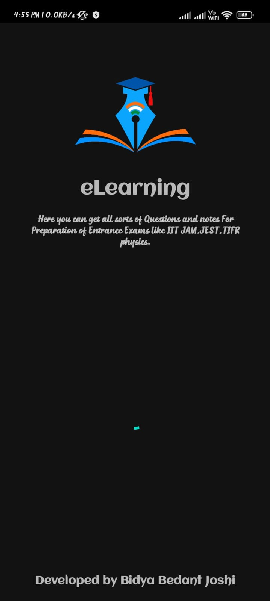
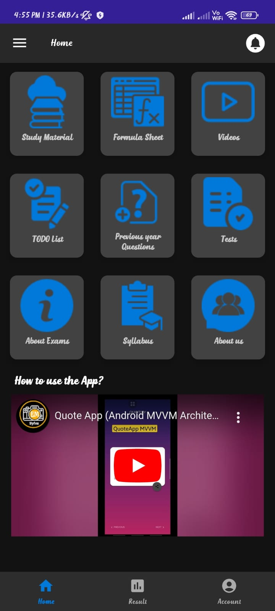
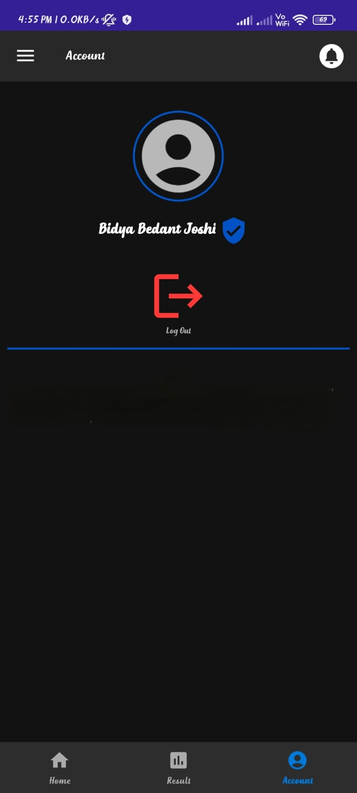
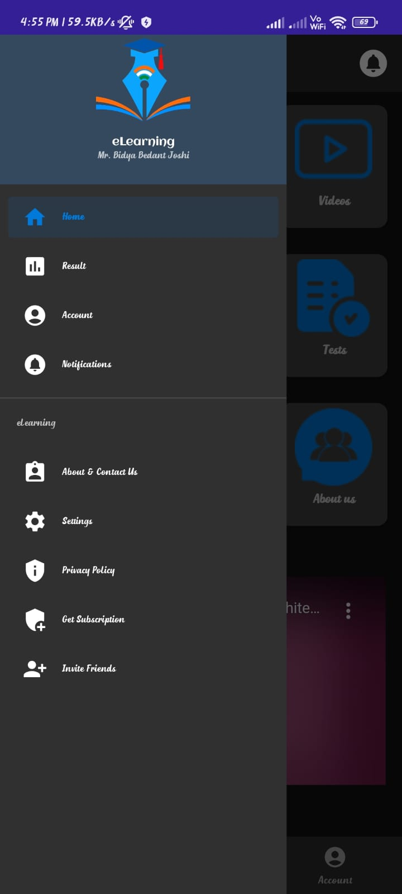
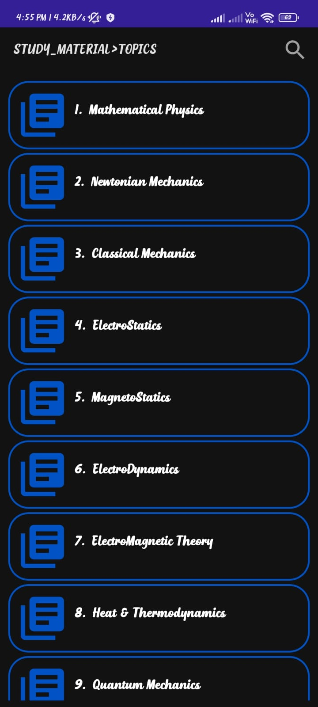
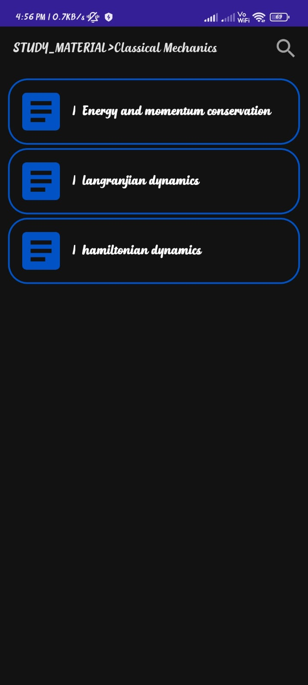
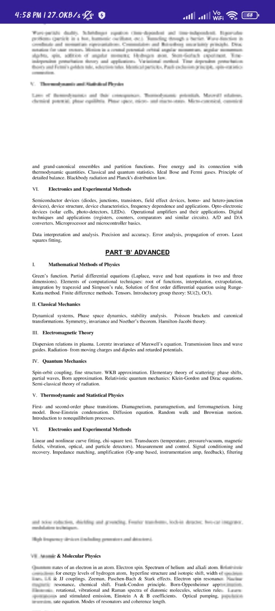
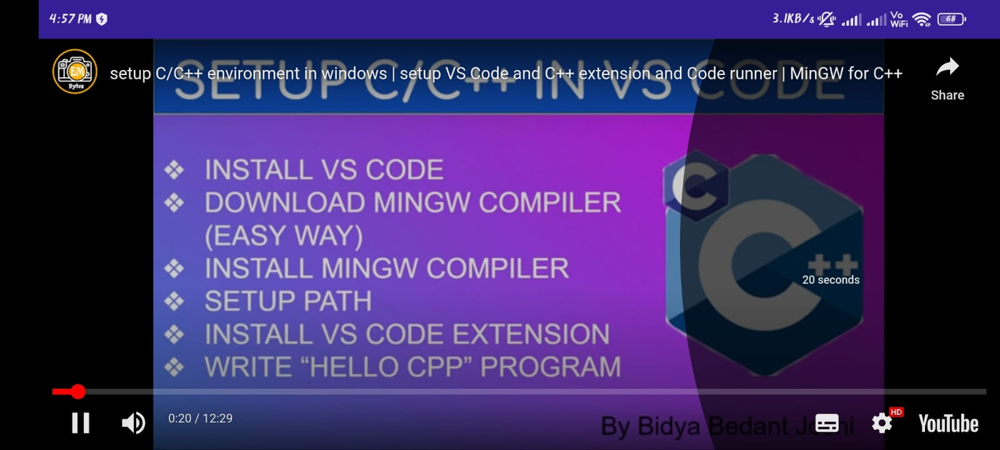
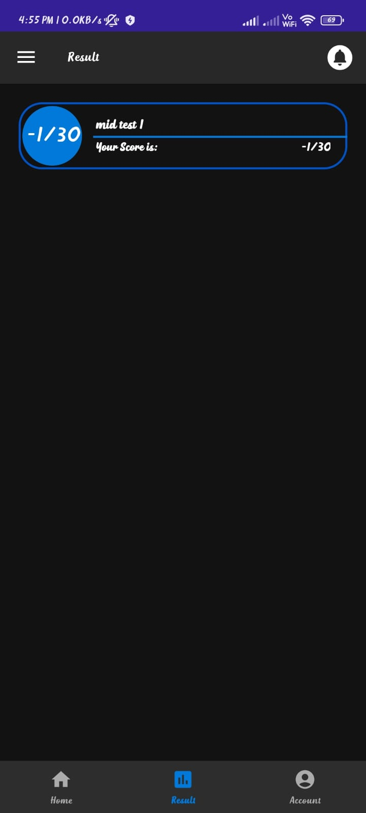
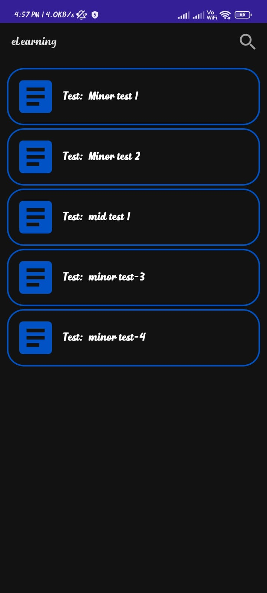
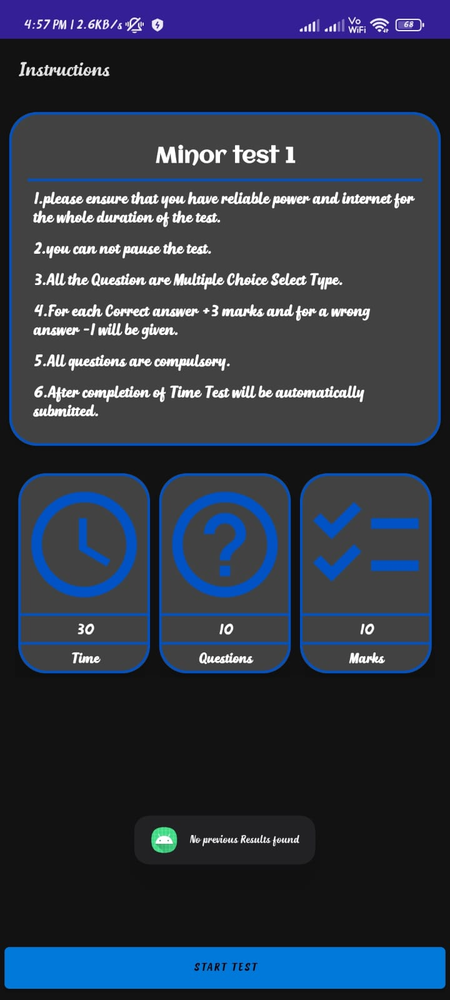
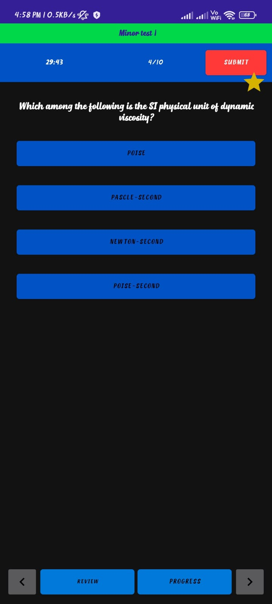
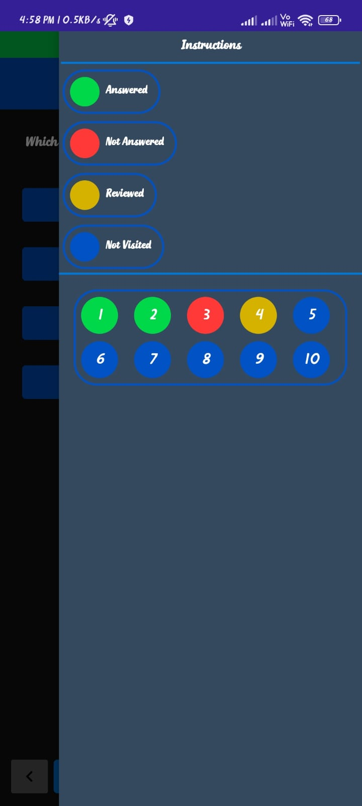
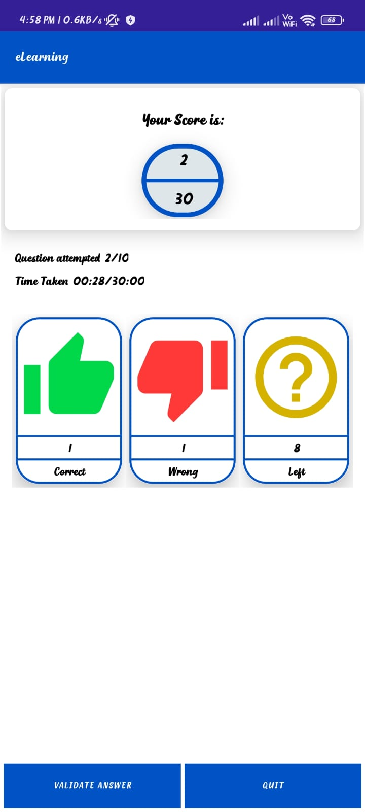
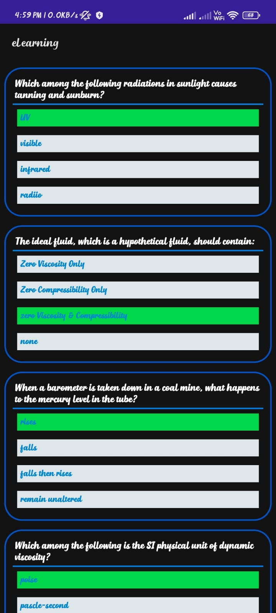

Here are some Basic features given through screenshoots.

## Installation

I will provide the release build on GitHub since I do not have a Google Play account to publish it on the Play Store. You can download the .apk file from the GitHub repository after the Proguard implementation and other bug fixes have been applied.

## Future Feature Enhancements

As the app evolves, several new features and enhancements are planned for implementation:

- **Advanced CRUD Operations in Task Scheduler**: Enhance the task scheduler with advanced CRUD (Create, Read, Update, Delete) operations, integrating internal file I/O operations for improved data management and efficiency.

- **Profile Activity Enhancement**: Add more information and editing capabilities to the profile activity, allowing users to update their profile details directly within the app.

- **Downloads Activity**: Implement a separate activity for downloading notes and assignments, saving them to external storage, and providing users with a centralized view of all downloads.

- **Notification Activity with BroadcastReceiver Integration**: Develop a notification activity integrated with BroadcastReceiver to deliver timely notifications to users about important updates and events.

- **Settings Activity Expansion**: Expand the settings activity to include options for font size adjustment, dark-light mode selection, offline reading mode, and other customizable preferences to enhance user experience.

- **Enhanced Question Section**: Integrate LaTeX libraries to display complex symbols and equations in the question section, providing a more comprehensive learning experience for users.

- **Enhanced Authentication**: Implement additional authentication options such as one-time password (OTP) for enhanced security and user verification.

- **Global Result Ranking**: Introduce a global result ranking feature for each test, allowing users to compare their performance with friends and peers, fostering healthy competition and motivation.

- **Answer Activity Improvement**: Enhance the answer activity to enable students to compare the correct answers with their responses, facilitating better understanding and learning from mistakes.

- **Memory Management and App Size Compression**: Focus on optimizing memory management and compressing app size using techniques such as V8, ProGuard, and ensuring protection against reverse engineering to improve overall app performance and security.
